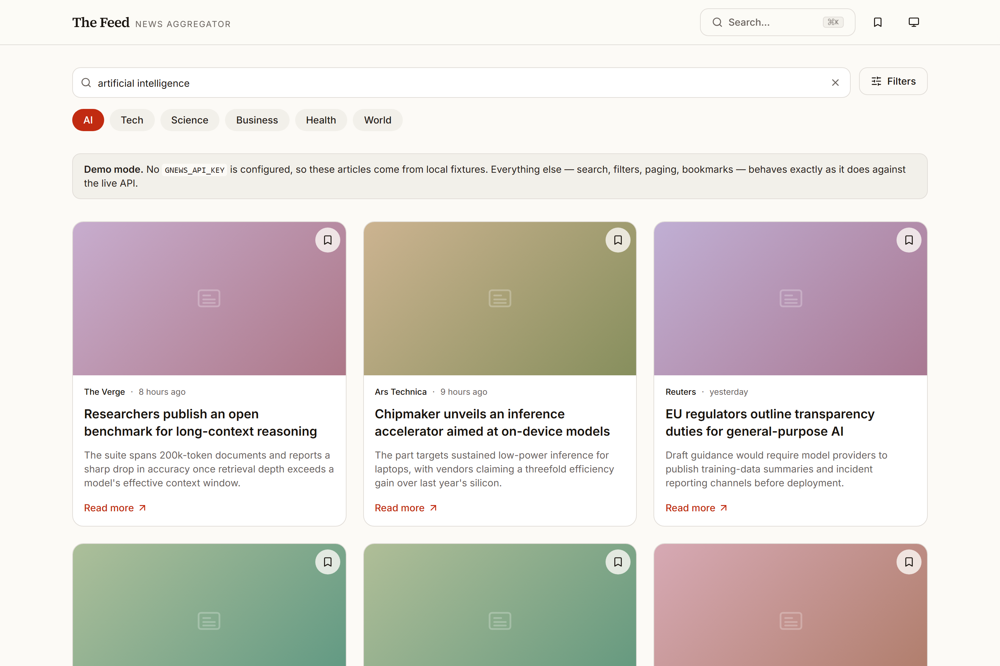
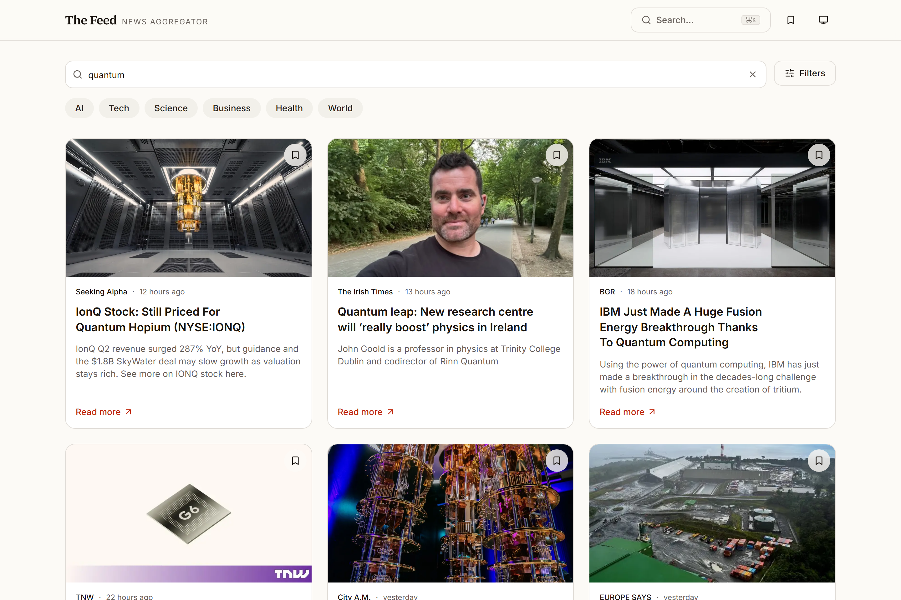

# 📰 News Aggregator App

A sleek and modern **news aggregator SPA** built with **React**, **Vite**, and **Tailwind CSS**, fetching real-time articles from the [GNews API](https://gnews.io/).

## 🌐 Live Demo

🔗 [Check it out here](https://newsaggregatorai.netlify.app/)

---

## ✨ Features

- 🔍 **Search with debounce** – smooth user experience, minimal API calls
- 🧠 **Category filters** – AI, Technology, Science, World, and more
- 📄 **Pagination** – load more without overwhelming the UI
- 📱 **Responsive design** – optimized for mobile and desktop
- 🖼️ **Fallbacks** – handles missing images, loading states, and API errors gracefully
- 🚀 **Blazing fast dev experience** – powered by Vite + Tailwind

---

## 💡 Purpose

The goal was to create a **real-world frontend application** that demonstrates:

- Effective **state management** and **UI composition** in React
- Practical **API integration** and **rate-limit handling**
- Attention to **UX/UI consistency** and **error resilience**
- A clean, accessible, and responsive layout built from scratch
- Comfort with modern frontend tools and workflows

---

## 🧑‍💻 Skills Showcased

| Skill Area            | Demonstrated By                                |
| --------------------- | ---------------------------------------------- |
| **React Development** | Functional components, `useState`, `useEffect` |
| **API Integration**   | Fetching & rendering live news via GNews API   |
| **UX Optimization**   | Debounced search, fallback UI, smooth loading  |
| **Tailwind CSS**      | Styled UI with responsive utilities            |
| **Performance**       | Lazy image loading, Vite HMR                   |
| **Problem Solving**   | Handling missing data, broken images, etc.     |
| **Tooling**           | Vite, PostCSS, ESLint                          |
| **AI**                | Qwen3                                          |

---

## 📁 Tech Stack

- **Framework:** [React](https://reactjs.org/)
- **Bundler:** [Vite](https://vitejs.dev/)
- **Styling:** [Tailwind CSS](https://tailwindcss.com/)
- **API:** [GNews.io](https://gnews.io/)

---

## 📸 Screenshots

### 🏠 Homepage

### 🔍 Search

### 📱 Mobile View

