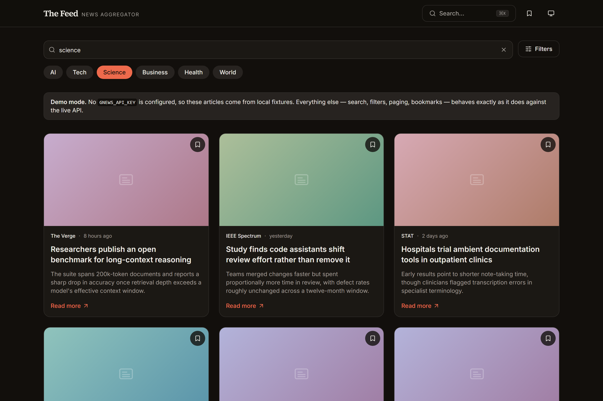

# The Feed — News Aggregator

[](https://github.com/PavluntiyJ/NewsAggregator/actions/workflows/ci.yml)

An installable, offline-capable news reader. Instant search with URL-addressable
state, infinite feed, bookmarks, and a command palette — built on Next.js 16,
React 19 and TypeScript.

> **Try it without signing up for anything:** `npm install && npm run dev`.
> With no API key configured the app runs against local fixtures, and every
> feature — search, filters, paging, bookmarks, offline — behaves exactly as it
> does against the live API.


<details>
<summary>More screenshots — dark theme, search, mobile</summary>




</details>

---

## Why a proxy

The single most interesting decision in this codebase is that **the browser
never talks to the news API.**

Version 1 read the key with `import.meta.env.VITE_GNEWS_API_KEY`. Anything
prefixed `VITE_` is inlined into the client bundle at build time, so the key was
readable in devtools by anyone who opened the deployed site. The free tier
allows 100 requests per day; a published key is a published budget.

Version 2 puts a Route Handler in front of it:

```
Browser ──► /api/news ──► GNews
           │
           ├─ key lives here, server-side only
           ├─ zod-validated params (malformed input degrades, never 500s)
           ├─ upstream response cached, so N visitors ≠ N upstream calls
           ├─ per-IP rate limit
           └─ upstream errors mapped to a typed vocabulary
```

The cache is not an optimisation. With a 100/day budget shared across every
visitor, an uncached deployment is exhausted within minutes of being linked
anywhere. `s-maxage=60, stale-while-revalidate=600` lets the CDN keep serving
the previous page while it refreshes behind the scenes.

## Features

| | |
|---|---|
| **Instant search** | Single properly-cancelled debounce; superseded requests are aborted, so a slow response can never overwrite a newer one |
| **URL as state** | Query, sort, language and country all live in the URL — every view is shareable and the back button works |
| **Infinite feed** | `IntersectionObserver` sentinel with a screenful of lead time, de-duplicated across page boundaries |
| **Bookmarks** | Persisted locally, synced across tabs, with undo on every destructive action |
| **Command palette** | `⌘K` / `Ctrl+K` — search, categories, recent searches, navigation, theme |
| **Offline** | Service worker: network-first for news, cache-first for images, cached shell for navigations |
| **Installable** | Web manifest, maskable icon, standalone display |
| **Themes** | Light / dark / system, with no flash on load and no hydration mismatch |
| **Accessible** | Skip link, labelled controls, `aria-pressed` state, live region for feed status, visible focus rings, honours `prefers-reduced-motion` |

## Stack

**Next.js 16** (App Router) · **React 19** · **TypeScript** (strict, with
`noUncheckedIndexedAccess`) · **Tailwind CSS v4** · **TanStack Query** ·
**Radix UI** + **cmdk** · **zod** · **Vitest** + **Testing Library** ·
**Playwright**

## Getting started

```bash
npm install
npm run dev          # http://localhost:3000 — works immediately, in demo mode
```

To use live data, get a free key at [gnews.io](https://gnews.io/) and put it in
`.env.local`:

```bash
GNEWS_API_KEY=your_key_here
```

Note the absent `NEXT_PUBLIC_` prefix — that is the point.

### Scripts

| Command | Purpose |
|---|---|
| `npm run dev` | Development server |
| `npm run build` | Production build |
| `npm run lint` | ESLint |
| `npm run typecheck` | `tsc --noEmit` |
| `npm test` | Unit tests (Vitest) |
| `npm run test:e2e` | End-to-end tests (Playwright) |

## Architecture

```
app/
  api/news/route.ts      the only place the API key exists
  page.tsx               Suspense boundary around the client feed
  bookmarks/page.tsx
lib/
  news-query.ts          zod schema — one definition shared by client and server
  server/news-service.ts upstream client, caching, error mapping
  server/rate-limit.ts   per-IP fixed window
  server/fixtures.ts     demo corpus for zero-config runs, CI and e2e
  local-store.ts         localStorage store shaped for useSyncExternalStore
hooks/                   feed params, infinite query, debounce, bookmarks
components/              UI, all presentational except the feed container
```

Two ideas hold the app together:

**One schema, both sides.** `lib/news-query.ts` defines the query shape once.
The route handler parses incoming search params with it; the client serialises
outgoing state with it. They cannot drift.

**Errors are codes, not strings.** The server maps every upstream failure onto a
small vocabulary — `rate_limited`, `quota_exceeded`, `upstream_unavailable`,
`not_configured`, `invalid_request` — and the client switches on those codes to
decide what to show and whether retrying is even worth offering.

## Testing

73 unit tests and 22 end-to-end scenarios, the latter run against both a desktop
and a mobile device profile. Everything executes against fixtures, so the suite
is deterministic, works offline, and never spends the API quota.

The e2e suite earned its keep during the rewrite by catching three defects that
all type-checked and linted cleanly:

- a stretched-link overlay that sat above the bookmark buttons and swallowed
  every click on them;
- a rate limiter that bucketed unidentifiable callers under one shared key,
  which behind a header-stripping proxy turns a per-client limit into a
  site-wide one;
- a service worker that registered on the `load` event, and so never registered
  at all when that event had already fired before the effect ran.

```bash
npm test          # unit
npm run test:e2e  # e2e (builds and starts the app automatically)
```

CI runs lint, typecheck, unit tests and Playwright on every push and PR.

## What changed from v1

Version 1 was a Vite + JavaScript SPA. The rewrite fixed a set of real defects,
each of which now has a regression test:

- **Exposed API key** → moved server-side behind a Route Handler.
- **Debounce that never cancelled.** The handler returned its cleanup function
  to nobody, so every keystroke left a live timer and fired its own request.
  A ten-character word meant ten requests.
- **Debounce applied twice**, in the filter bar and again in the list, adding up
  to ~1.5s before a search ran. Now one debounce, 350ms.
- **Page index survived a new search.** Searching from page 5 kept you on page 5
  of the new results. State now lives in the URL and resets correctly.
- **No request cancellation.** Out-of-order responses could overwrite newer
  results. Requests are now aborted when superseded.
- **A dead error branch.** The retry button checked `errorMessage.includes("rate limit")`,
  but the rate-limit path set a message that never contained that phrase, so the
  branch could not run. Errors are typed codes now.
- **`alert()` on failure** → non-blocking toasts.
- **`key={index}` on the article list**, which made React reuse the wrong DOM
  nodes when the page changed. Keyed by article URL now.
- **Broken image handling** that pointed at a relative path (breaking on nested
  routes) and could loop if the fallback itself failed. Replaced with a painted
  gradient placeholder.
- **No accessibility affordances** — no input label, no live region, no focus
  management. All added.

## Licence

MIT
