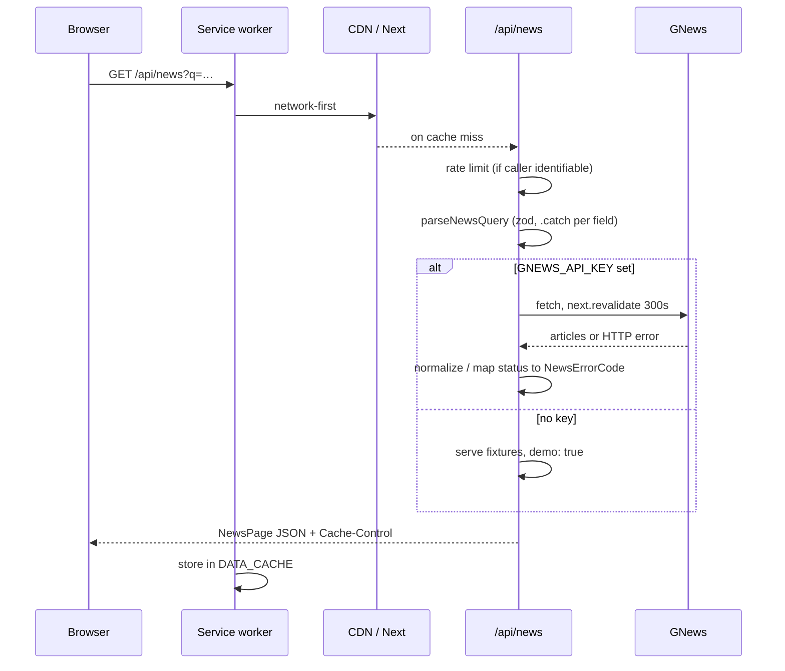

# Architecture

How a request becomes rendered news, and who owns which piece of state.
Read [../AGENTS.md](../AGENTS.md) first for the invariants this document assumes.

## Request lifecycle



When the network is gone, the service worker serves the last successful response
from `DATA_CACHE` instead, and navigations fall back to the cached shell.

## The server boundary

Everything under `lib/server/` and `app/api/` imports `server-only`, which makes
importing it from a client component a build error rather than a runtime leak.
That boundary exists for exactly one reason: `GNEWS_API_KEY` must never be
reachable from the browser bundle. See ADR-001 in [DECISIONS.md](DECISIONS.md).

```
client                          │ server-only
────────────────────────────────┼──────────────────────────────
components/*                    │ app/api/news/route.ts
hooks/*                         │ lib/server/news-service.ts
lib/api-client.ts               │ lib/server/rate-limit.ts
lib/local-store.ts              │ lib/server/fixtures.ts
────────────────────────────────┼──────────────────────────────
        shared: lib/news-query.ts, lib/types.ts, lib/utils.ts
```

`lib/news-query.ts` sitting in the shared column is the point: the server parses
incoming search params with the same zod schema the client uses to serialise
outgoing URL state, so the two cannot drift apart.

## State ownership

Each kind of state has exactly one home. Duplicating any of it is how the v1
bugs happened.

| State | Owner | Notes |
|---|---|---|
| Search query, sort, language, country, page size | **URL search params** | via `hooks/use-feed-params.ts`; every view is shareable, back button works |
| Fetched article pages, loading and error status | **TanStack Query** | keyed on the filter tuple; `staleTime` 60s |
| Bookmarks, search history | **localStorage** | via `lib/local-store.ts` + `useSyncExternalStore`; synced across tabs |
| Theme | **next-themes** | class on `<html>`, written before hydration |
| Command palette open/closed | **React context** | `components/command-palette.tsx` |
| Text currently in the search box | **local component state** | mirrors the URL, guarded by `lastPushedRef` — see [GOTCHAS.md](GOTCHAS.md) |

Page index is intentionally *not* in the URL. The infinite feed always starts at
page 1 and accumulates; putting the cursor in the URL would make a shared link
open mid-scroll with a gap above it.

## Caching layers

Four caches sit in the path, each with a different job. Know which one you are
looking at before concluding something is stale.

| Layer | Where | Lifetime | Purpose |
|---|---|---|---|
| TanStack Query | Browser memory | 60s stale, per session | Avoids refetching while the user toggles filters back and forth. Never refetches on its own — see ADR-012 |
| Service worker `DATA_CACHE` | Browser disk | Until evicted, max 30 entries | Offline fallback only; never preferred over the network |
| CDN | Vercel edge | `s-maxage=60`, `stale-while-revalidate=600` | Absorbs concurrent visitors |
| Next data cache | Server | `NEWS_CACHE_TTL`, default 300s | Keeps the app inside the 100 requests/day upstream quota |

The bottom layer is load-bearing rather than an optimisation: the free tier
budget is shared across every visitor, so an uncached deployment is exhausted
within minutes of being linked anywhere.

## Rendering

`app/page.tsx` is a Server Component that renders a Suspense boundary around
`NewsFeed`, which is a Client Component because it reads `useSearchParams`.
Without that boundary the whole route would bail out to client-side rendering.

The shell — header, footer, skip link, offline banner — is static and prerendered.
Only `/api/news` is dynamic.

## Error handling

The server maps every upstream failure onto a small vocabulary before it crosses
the wire:

| Code | Cause | Client behaviour |
|---|---|---|
| `rate_limited` | Upstream 429, or our own limiter | Message, no retry button |
| `quota_exceeded` | Upstream 403 | Message, no retry button |
| `not_configured` | Upstream 401 — our key is bad | Message, no retry button |
| `upstream_unavailable` | 5xx, network failure, malformed JSON | Message with retry |
| `invalid_request` | Upstream 400 | Message, no retry |

`TERMINAL_ERROR_CODES` in `lib/api-client.ts` decides both whether TanStack
retries and whether the UI offers a retry button. Offering a retry that cannot
succeed is worse than offering none.
